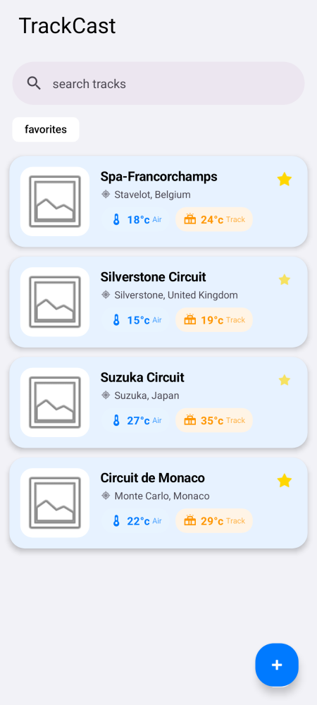
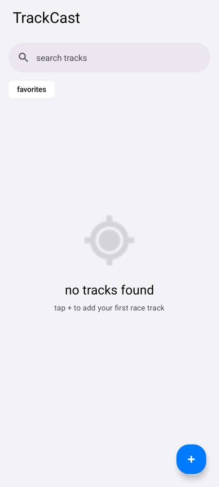
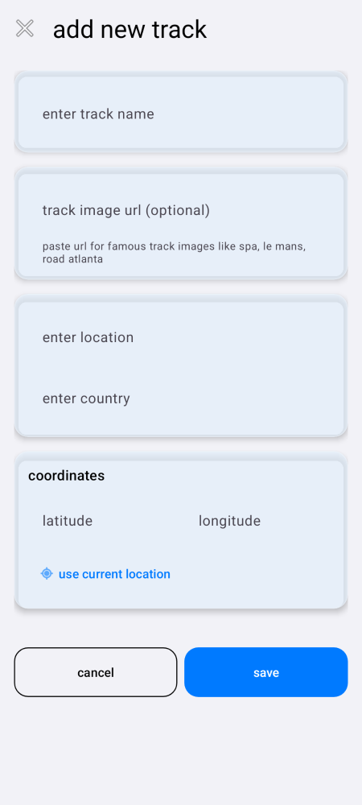

# TrackCast

Android app for tracking live weather and track-surface conditions at race circuits. Built to get hands-on with a modern native Android stack (Kotlin, MVVM, Hilt, Room) on something more concrete than a todo app.

Save your favorite circuits, pull live air and track-surface temperature for each, and filter down to the ones you care about.

---

## Screenshots

**Track list** - saved circuits with live air and track-surface temperature, favorites starred



**Empty state** - first-run state before any tracks are added



**Add track** - name, location, coordinates (or use current location), and an optional image



---

## What it covers

| Layer | Output |
|---|---|
| Persistence | Room database for tracks, weather readings, and user prefs |
| Networking | Retrofit + OkHttp against [WeatherAPI.com](https://www.weatherapi.com/) for live conditions |
| DI | Hilt-wired repositories and ViewModels across both activities |
| UI | Material 3 + ViewBinding, iOS-inspired glassmorphism, light/dark themes |
| Location | FusedLocationProvider for "use current location" when adding a track |
| Screenshot testing | Paparazzi renders app screens on the JVM, no device required |

## Tech stack

- Kotlin, MVVM
- Hilt for dependency injection
- Room for local persistence
- Retrofit + OkHttp for networking
- Material 3 components
- Paparazzi for screenshot tests

## Setup

Requirements: Android Studio (or the command-line SDK tools), JDK 17+, and a free [WeatherAPI.com](https://www.weatherapi.com/) API key.

```bash
git clone https://github.com/jooondam/TrackCast.git
cd TrackCast
```

Add your API key to `local.properties` (create the file if it doesn't exist):

```properties
WEATHER_API_KEY=your_api_key_here
```

## Run the app

Open the project in Android Studio and run it, or build from the command line:

```bash
./gradlew assembleDebug
```

The app requests location permission to support "use current location" when adding a track; it's optional and only used for that.

## Tests

```bash
./gradlew testDebugUnitTest
```

Screenshot tests live under `app/src/test/java/com/example/trackcast/screenshot/`, golden images under `app/src/test/snapshots/`. Update them after a UI change with:

```bash
./gradlew recordPaparazziDebug
```

## Project structure

```
app/src/main/java/com/example/trackcast/
  data/
    entities/        RaceTrack, WeatherData, User (Room entities)
    dao/             Room DAOs
    database/        AppDatabase, repositories
    network/         WeatherApiService, DTOs, NetworkResult
    mapper/          API response -> entity mapping
  di/                Hilt modules (database, network, repositories)
  ui/
    adapter/         RecyclerView adapter + swipe-to-delete
    viewmodel/       RaceTrackViewModel, WeatherViewModel, UserViewModel
  util/              ThemePreferences
  MainActivity.kt    Track list, search, favorites filter
  AddTrackActivity.kt  Add / edit a track
app/src/test/
  java/.../screenshot/  Paparazzi screenshot tests
  snapshots/            Golden images
```

## Data notice

TrackCast doesn't ship an API key. Bring your own free [WeatherAPI.com](https://www.weatherapi.com/) key and drop it in `local.properties` as shown above; it's git-ignored and never committed.
